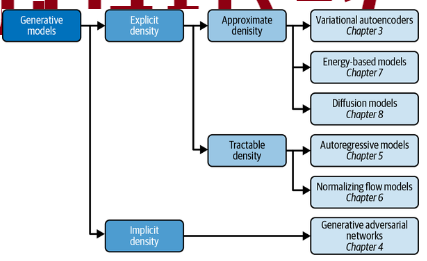

List of common buzz words

-  vanishing gradient
-  Batch normalization
-  Latent space
-  Upsampling
-  Increasing/decreasing channels and spatial shape
-  LSTM/GRU

Representation learning  - mapping high dimensional data to latent space(lower dimmensional)

**Latent space**: refers to an *abstract multi-dimensional space* containing feature values that we cannot interpret directly, but which encodes a meaningful internal representation of externally observed events.

Implicit models - producing stochastic prcess that generates data - GAN

Tractable models - density function has form easy to calculate

- autoregressive models impose order of input features
- nomralizing flow - series of tractable, invertible functions
- approximate density models - variational autoencoders - approx joint denisty function with latent variable
- energy based - markov chains

## Autoencoder

- encoder - converts input to embending latent vector(of lower dimensionality)
- decoder can be used to generate new images - probing latent space
- can be used as denoisers - autoencoder learns that is not useful to learn

### Encoder

- consist of input, hidden layers of types
    - dense - tabular, flattened
    - convolutional - spatial
    - recurrent - sequential data, temporal dynamic
    - transformer - sequential data, self attention, long range dependencies
- bottleneck - reduces dimensionality to final latent representation

### Decoder

- mirror image of encoder
- need for `Conv2DTranspose` - allows for upsampling information

## GAN

### Discriminator

- predicts if observation is from original distribution
- solves supervised classification problem
- similar to encoder - reduces spatial shape while increasing number of channels, but has one number at the end
- learning: images from real dataset and from generator with labels

### Generator

- converts random noise into observations
- input is vector taken from multivariate standard normal distribution
- increases spatial shape while decreasing number of channels
- learning: loss function is output of discriminator

### Problems

- discriminator overpowers generator - try to weaken discriminator - stronger dropout, smaller learning rate, less cnn filters, noise to labels, flipping labels at random
- generator overpowers discriminator(mode collapse) - generator finds single observation(mode) that always fools discriminator → every point in latent spaced mapped to that observation
- uninformative loss - generator loss has to increase - discriminator becomes better at distingishing input but that also means generator becomes better at generating images

### Wasserstein GAN with Gradient Penalty

- meaningfull loss metric that correlates with generator convergence
- better stability of learning

## LSTM

### LSTM cell

- cell state - aggregated of data from previous processed steps
- hidden state - encoding of recent time-step
- Consist of gates of formula $f_t=\sigma((W_{hf} \times h_{t-1})+(W_{xf} \times x_t)+b_f)$
- Forget gate - tells how important is aggregated history
- Input gate - tells how much input should change internal cell state
    - Input node - tanh activation - $\tilde{C}$
- Output gate - how important is internal state for whole cell output

Cell internal state $C_t=F_t \odot C_{t-1}+ I_t \odot \tilde{C}$

Hidden state $H_t = O_t \odot tanh(C_t)$

(sigmoid func - amplify/diminish; tanh func - transform into normalized encoding of data)

