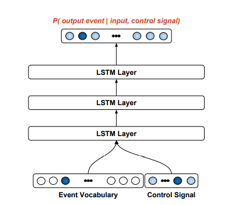

Post where I dump papers with generative conditioned models. Currently: Performance RNN, Music transformer, RAG, Efficient Neural Music Generation

<!--more-->

Buzz words

- few-shot
- Performance RNN and signals
- beam search
- 

## RAG

https://blogs.nvidia.com/blog/what-is-retrieval-augmented-generation/

> Judges hear and decide cases based on their general understanding of the law. Sometimes a case — like a malpractice suit or a labor dispute — requires special expertise, so judges send court clerks to a law library, looking for precedents and specific cases they can cite. Like a good judge, large language models (LLMs) can respond to a wide variety of human queries. But to deliver authoritative answers that cite sources, the model needs an assistant to do some research.

The court clerk of AI is a process called retrieval-augmented generation, or RAG for short.

https://arxiv.org/abs/2311.10384

Retrieval augmented generation (RAG) is a technique where a language model is augmented with a retrieval system capable of accessing an database. [2] Liu et al. [3] propose using a retrieval system to select a relevant set of few-shot examples for prompting the LLM into solving a particular task instance
The role of the
Retrieval LLM is to take the user request and search a database for relevant music examples to add to the prompt.

### Jaccard Similarity
https://medium.com/@mayurdhvajsinhjadeja/jaccard-similarity-34e2c15fb524

Jaccard Similarity is a measure of similarity between two asymmetric binary vectors or we can say a way to find the similarity between two sets. It is a common proximity measurement used to compute the similarity of two items, such as two text documents. The index ranges from 0 to 1.

J(A, B) = |A∩B| / |A∪B|

## Performance RNN

https://arxiv.org/pdf/1907.04352.pdf

Computational, automated, and stochastic generation of music are pursuits of long-standing interest

In a typical auto-regressive language model, the system generates a discrete probability distribution P(event0), samples from that distribution, and then uses its own sampled event history to condition the probability distribution over the next event to be predicted. An RNN model with a finite vocabulary is continually predicting $P(eventt|eventi<t)$, where each eventt is drawn from the vocabulary.

One can adapt an auto-regressive language model so that its predictions are conditioned not only on the past events, but also on an externally-specified signal.

ePiano Junior Competition Dataset

https://neuripscreativityworkshop.github.io/2023/
https://magenta.tensorflow.org/demos/web/
https://magenta.tensorflow.org/piano-transformer

The raw MIDI files were converted to the Performance RNN representation, with a 388 word vocabulary consisting of 128 note-on, 128 note-off, 100 time-shift, and 32 velocity events. Performances are modelled as sequences of these events, and are fed into the neural network using a one-hot vector encoding at each step.

https://github.com/magenta/magenta

Additionally, we augmented the dataset with transpositions of up and down all intervals up to five or six semitones (spanning a full octave), and with
temporal stretches/compression factors of 2.5% and 5%, increasing the number of training samples 35-fold. We train the model on 30 s segments from the MIDI performances using teacher forcing.

To achieve a conditional variant of Performance RNN, an additional feature vector is provided to the model along with each event, which we refer to as a control signal. At training time, the control signal provides additional information about the performance using metadata such as the composer of the piece. When generating samples from the model, we can then constrain it to output a performance in the style of a single composer, for instance

Various control signals were used, each described in more detail in the following sections. Briefly, we had 3 sources for our control signals.
• Signals corresponding to the local statistics of the clip within the performance (note density, note velocity, and relative positioning within the piece).
• Metadata directly available from the dataset (composer, and from this, attributes of the composer such as their year of birth).
• Metadata extracted from the titles of the pieces (key, tempo and form).

We explored two types of control signals using the composer, either conditioning on the composer of the piece directly, or clustering the composers into groups and conditioning on the group.

Time-period Conditioning As with any art form, styles of composition evolve over time; many styles of classical music are associated with the period of history in which they originated and proliferated.

methodology of PerformanceRNN’s optional conditioning inputs. With this method, when the control signal is unknown it is filled with zeros, and the conditioning signal is prepended by an additional bit, c0, which indicates whether the control signal is provided. For instance,
the new conditioning input would be [0, c1, c2, . . .] when the
control is available and [1, 0, 0, . . .] when it is not.

We did not attempt to train a model conditioned on more than two control signals simultaneously; if the amount of metadata provided to the model becomes too large, the model will receive enough information to identify exactly which piece the training sample is from, increasing the risk of overfitting.

A purely autoregressive model is a greedy search, selecting the output at each single step without consideration for the future generation steps. However, sometimes it is better to select a less likely output for the current timestep in return for a payoff later of a more likely sequence overall. One possible augmentation to this generation procedure is beam search. With beam search, our goal is to generate a series of outputs which collectively have a high joint loglikelihood.
We found beam search was prone to generating outputs with locally low entropy, such as repeating the same note or same two notes throughout the piece, similar to using plain autoregression with a low temperature. Intuitively, this is because generating a large number of samples from a distribution and then selecting the one with the maximum loglikelihood is equivalent to selecting the sample with highest loglikelihood.

Another variant of this is stochastic beam search, which selects which beams to retain with probabilities based on their loglikelihoods. We also tried stochastic beam search (using a temperature of 1) with the same beam search parameters as above, and found this to give perceptually similar results.

#### Teacher forcing
eacher forcing is a technique used in the training of generative models, especially in the context of sequence-to-sequence models, such as those used in natural language processing (NLP) for tasks like machine translation, text summarization, and speech recognition. It involves using the true output from the training dataset at the current time step as input for the next time step, rather than the output generated by the model. This approach is used to speed up training and improve model performance by providing the model with the correct context for generating the next part of the sequence.

Initial Step: The model receives an input sequence and generates the first output.
Subsequent Steps (without Teacher Forcing): The model would take its previously generated output as the input for generating the next part of the sequence. This is how the model would operate during inference or prediction time.
Subsequent Steps (with Teacher Forcing): Instead of using its own outputs, the model is given the actual, true output from the training data as the next input, regardless of what the model itself generated in the previous step.

## Music transformer

todo:
- https://arxiv.org/pdf/1809.04281.pdf
- https://arxiv.org/abs/1806.09905
- https://assets.pubpub.org/2gnzbcnd/11608661311181.pdf
- https://arxiv.org/pdf/1708.03535.pdf
- https://www.mdpi.com/2227-7390/11/8/1915
- https://proceedings.neurips.cc/paper_files/paper/2023/file/38b23e2328096520e9c889ae03e372c9-Paper-Conference.pdf