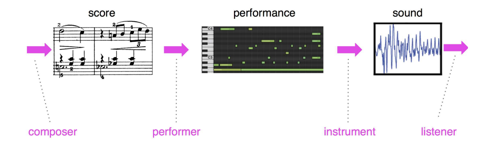

Notes taken in order to implement pytorch Performance RNN net for midi

<!--more-->

> talking about music is like dancing about architecture

https://arxiv.org/pdf/1808.03715.pdf

https://robzz.medium.com/performancernn-with-note-on-conditioning-fac981f82d10

## Introduction and hints

And yet, by the time the music is heard as audio, most of this timing information will have been intentionally not followed exactly! For example, in classical music from the 1800’s onwards, rubato developed: an expressive malleability of timing that overrides metrical accuracy (i.e. can deviate very far from the grid), and this device is both frequent and essential for making perceptual sense of certain pieces.

Phrasing includes a joint effect of both expressive timing and dynamics. For example, there is a natural correlation between the melody rising, getting louder, and speeding up. These are not rules, however; skilled performers may deliberately choose to counteract such patterns to great effect.

Corresponding to the second step in Figure 3 is a body of work often referred to as EMP (Expressive Musical Performance) systems.

Out of those systems, two use neural networks (one of which also uses performance rules) and a few more use PCA, linear regression, KCCA, etc. Some of the other systems that involve some learning, do so by learning rules in some way. For example, the KTH model [11] consists of a top-down approach for predicting performance characteristics from rules based on local musical context. Bresin [4] presents two variations of a neural network-based system for learning how to add dynamics and timing to MIDI piano performance.

 In both of these cases, the dynamics predictions appear to depend on the micro-timing rather than being predicted jointly as in the present work.

 In the case of both score production and interpretation, any computational
model naturally makes assumptions. 

Music with very long-term, fully coherent structure is still elusive. In “real” compositions, long-term structure spans the order of many minutes and is coherent on many levels. There is no current system that is able to learn such structure effectively. That is, if ∆t = 8ms, then even for just 2 minutes, P(ei+15000|ei) should be different from P(ei+15000). There is no current system that effectively achieves anywhere near this for symbolic MIDI representation.

## Architecture

We modeled the performance data with an LSTM-based Recurrent Neural Network. The model consisted of three layers of 512 cells each.

### Representation
- 128 NOTE-ON/OFF
- 125 TIME-SHIFT events: each one moves the time step forward by increments of 8 ms up to 1 second.
- 32 VELOCITY events: each one changes the velocity applied to all subsequent notes

The neural network operates on a one-hot encoding over this event vocabulary. Thus, at each step, the input to the RNN is a single one-hot 413-dimensional vector