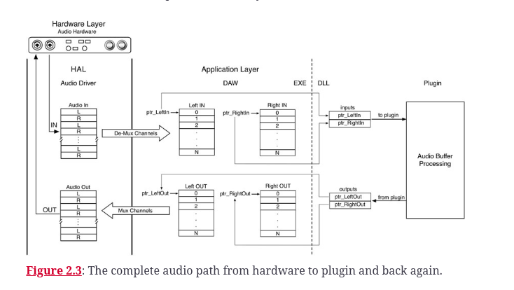
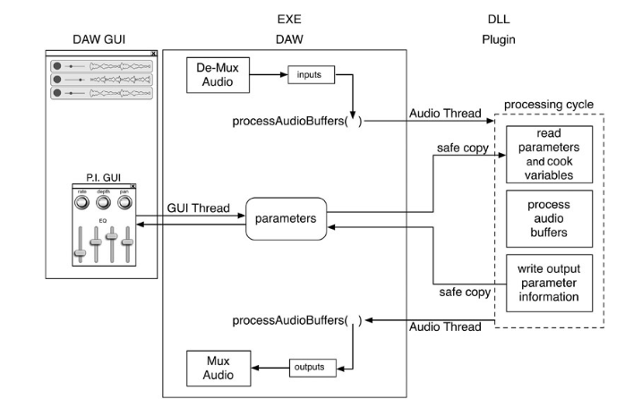
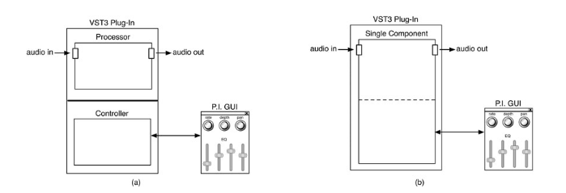
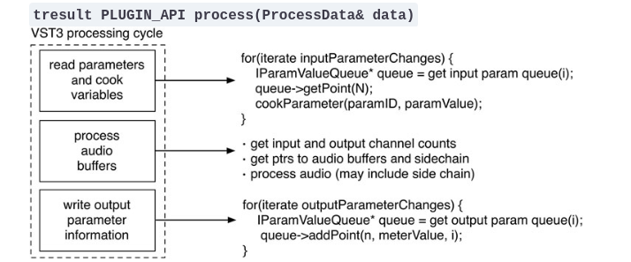

Notes taken from reading "Designing Audio Effect Plugins in C++, 2nd Edition"

<!--more-->

## Designing Audio Effects in C++

### Overview
- **Plugin and Host**: A plugin is a signal processing unit, developed as C++ objects, that manipulates audio within a Digital Audio Workstation (DAW) or similar software, referred to as the host.

### Development Essentials
- **SDKs and APIs**: Each plugin API comes in a Software Development Kit (SDK) without precompiled libraries, necessitating viewing and compiling the code for framework use (e.g., JUCE, ASPiK).
- **DLLs and Runtime Linking**: The plugin is compiled into a DLL, linked at runtime by the DAW, facilitating the processing of audio data.

Using frameworks like JUCE is crucial for streamlining the development process of audio plugins across different platforms and plugin formats (VST, VST3, AU, AUv3, AAX, and LV2). JUCE, being open-source, offers extensive documentation and a robust library of DSP building blocks, allowing developers to concentrate on the creative aspects rather than the nuances of each operating system or plugin host. It ensures compatibility across major DAWs like Logic, Live, Pro Tools, FL Studio, and Cubase, facilitating a unified codebase for diverse plugin formats​ (JUCE)​.

### Plugin Lifecycle
1. **Validation Phase**: Initial loading by the host to ensure compatibility, involving plugin identification and functionality checks.
2. **Loading Phase**: Post-validation, plugins await user activation, at which point they're loaded into the DAW's process space.
3. **Processing Phase**: Involves the core DSP algorithm processing audio data sent by the host, then returning the modified audio.

### Plugin Description and Parameters
- **Initial Setup**: Describing the plugin to the host through API-specific mechanisms, including simple strings and more complex requirements (e.g., side-chain input, latency information).
- **Parameter Declaration**: Critical for integration, involving GUI controls linked to C++ object parameters for host interaction during automation or session management.

The initial setup for plugin development involves not just providing basic information but also specifying more complex features like side-chain inputs or latency details. This stage is foundational for ensuring that the plugin can interact effectively with the host and the users through its GUI. The design and prototype phases are crucial for shaping the plugin's functionality and user interface, based on the developer's vision and the intended audio processing capabilities​ 

### GUI and User Interaction
- Plugins typically require a GUI for user interaction, with each control tied to specific plugin parameters. These need to be declared to the host for session management and automation purposes.

### Audio Processing Fundamentals
- **Sample Rates**: Plugins must accommodate various DAW sample rates, essential for the DSP algorithms used in processing the audio signal.
- **Pre-Processing Requirements**: Includes resetting the algorithm, clearing memory structures, and preparing for new audio data.
- **Audio Data Handling**: Process involves converting audio input/output samples, typically formatted as floating-point data, and managing data through buffer or frame processing.

### Multithreading and Parameter Management
- **Parameter Changes**: Handling changes from GUI interaction or automation is complex, requiring careful management to prevent disruption during processing.
- **Thread Safety and Asynchrony**: Plugin development involves multithreading to manage parallel tasks of audio processing and user interaction, requiring thread safety mechanisms provided by each API.

### Key Plugin Functions
- Plugins are implemented as C++ objects with responsibilities including parameter initialization, processing audio with DSP algorithms, and GUI rendering, with a preference for separating GUI implementation into its own object.

### Challenges and Considerations
- **Thread Safety and Data Access**: Addressing the access of shared data by multiple threads, ensuring thread safety within plugin operation.
- **Parameter Smoothing**: Implementing interpolation to manage parameter changes smoothly, essential for eliminating artifacts like clicks or zipper noise.

### Conclusion
- Designing audio effects in C++ involves understanding the plugin-host interaction, managing the plugin lifecycle, handling audio data and parameters effectively, and ensuring smooth operation through careful multithreading and parameter management practices.

## VST3

### Plugin Packaging

- The VST3 SDK packages Windows and MacOS plugins in a bundle, which acts like a directory.
  - For MacOS, users can right-click on the plugin "file" and select "Show Package Contents" to view the bundle's contents.
- Includes **VSTGUI4** for custom GUIs, but other GUI development libraries can be used.
  - VSTGUI4 is designed for direct interface with VST3.
  - ASPiK uses VSTGUI4 for GUI library operations.

### Core Architecture: VST-MA

- Based on, but not identical to, Microsoft’s Common Object Model (COM).
  - Allows for easy updates and modifications without breaking older versions.
  - COM is a programming approach independent of programming languages.
  - VST-MA currently supports only C++.

#### COM Programming

- Revolves around the concept of an interface.
  - Used in FX objects (IAudioSignalProcessor and IAudioSignalGenerator).
- An interface is a C++ object defining only virtual functions, acting as an abstract base class.
  - No member variables.
  - Inheriting classes must override any defined pure abstract function.
- Some interfaces are pure abstract, requiring all functions to be implemented in the derived class.
- Similar to the Objective C protocol, where a class implements required methods to "conform to a protocol."

### Plugin Development Paradigms

#### Dual Component Pattern

- Plugins are implemented as two separate C++ objects:
  1. **Processor object** for audio signal processing.
  2. **Controller object** for the GUI interface.
- These objects are isolated from one another to allow running on separate CPUs.
  - Aligns with the C++ object-oriented design paradigm.
  - Facilitates use on multi-CPU platforms, enhancing performance.
- However, this separation can complicate plugin development compared to AU and AAX versions.
  - Some architectures may not support distribution across separate CPUs or may become overly complex under this paradigm.

#### Single Component Paradigm

- Allows for a monolithic C++ object to handle both processing and GUI interfacing.
- Implemented through multiple inheritance from processor and controller objects.
  - **SingleComponentEffect**: A C++ object inheriting the functionalities of both the processor and controller.
- This paradigm simplifies the architecture by merging processing and GUI duties into a single component.
- Used exclusively in the book and ASPiK for simpler plugin development.

### Base Classes for Plugin Development

- **AudioEffect**: Base class for the processor object in the dual component paradigm.
- **EditController**: Base class for the controller object in the dual component paradigm.
- **SingleComponentEffect**: The single object base class for the single component paradigm.
  - Inherits functionalities from both AudioEffect and EditController.

### Handling Success/Failure Codes

- VST3 plugins use a 32-bit unsigned integer typedef'd as `tresult` for success/failure codes.
  - `kResultTrue` or `kResultOK` indicate success (both are identical).
  - Failure codes include `kResultFalse`, `kInvalidArgument`, `kNotImplemented`, among others defined in `funknown.h`.

### Plugin Instance Management

#### Class Factory Approach

- VST3 employs a class factory method for generating multiple plugin instances in a DAW session.
  - Requires caution with singletons and other anti-patterns, which may not work as expected.

#### Resource Management

- Construction and destruction of dynamically allocated resources occur via `initialize()` and `terminate()` functions, not in the constructor/destructor of the C++ object.
  - In the dual component paradigm, these functions are part of the processor object.
- This approach is specific to managing the lifecycle of plugin resources within the VST3 environment.

### Audio Busses Concept

- FX plugins typically have one input buss and one output buss, with varying numbers of channels.
- Side chain inputs are declared as separate input busses, usually in stereo.
- Adding an audio buss involves specifying a name, speaker arrangement, and optionally, a buss type and info (e.g., `kAux` for side chains).

### Plugin Latency

- Plugins that introduce a fixed latency (e.g., for processing like PhaseVocoder or look-ahead compressors) must report this to the host.
  - The `getLatencySamples()` function returns the latency in samples, which the host queries.

### Tail Time

- Relevant for reverb and delay plugins, allowing their effects to fade out post playback.
- Reported in samples via the `getTailSamples` function, adjusted for sample-rate dependence.

### GUI Implementation

- The controller part, in both dual and single component versions, must implement the `createView` function for custom GUIs.
  - Returns an `IPlugView` pointer, conforming to its protocol and implementing its pure virtual functions.

### Plugin Parameters Initialization

- Parameters communicate with the GUI as normalized values ([0.0, 1.0]), distinct from their "plain values".
  - Example: A volume control adjusted to −3 dB would have a normalized value transmitted as 0.7917.

### Defining Plugin Channel I/O Support

- VST3 supports a wide range of audio channel formats, including traditional, Ambisonics®, and 3-D formats.
- Plugins must respond to the host's queries about supported formats and set up audio busses accordingly.
  - Involves using `addAudioInput` and `addAudioOutput` functions and potentially resetting busses for new configurations.

#### Channel I/O and Speaker Arrangements

- Definitions for input/output channel formats are found in `vstspeaker.h`.
- Plugins must be able to adapt to the host's queries for specific channel formats or sub-formats.

#### Handling Audio I/O Schemes

- Plugins may need to set up audio I/O twice: initially in the `initialize` function and again in response to `setBusArrangements` queries.
  - This ensures compatibility with varied and potentially limited host capabilities.

Integrating the information on host information into your markdown notes:

### Host Information for Plugins

- VST3 plugins receive extensive host information via the `processData` argument's `processContext` member during the audio processing cycle.
  - **Key Data Provided:**
    - Absolute sample position of the audio file for the current processing cycle.
    - DAW session’s BPM (beats per minute) and time signature settings.
    - Audio transport status (playing, stopped, looping).

#### Support Across Hosts

- While not all VST3 hosts support every detail of host information, essential elements such as absolute sample location, BPM, and time signature are consistently well-defined across tested VST3 clients.

#### Importance for Plugins

- This information is crucial for plugins requiring synchronization with the host's playback, tempo, and musical timing, enhancing their functionality and integration within a DAW environment.

### Links

- https://github.com/keithhearne/VSTPlugins/tree/master
